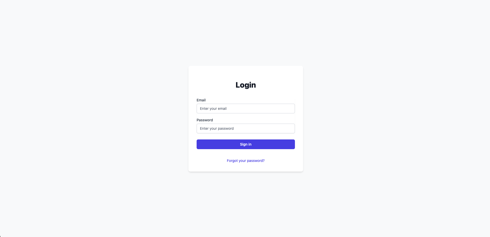
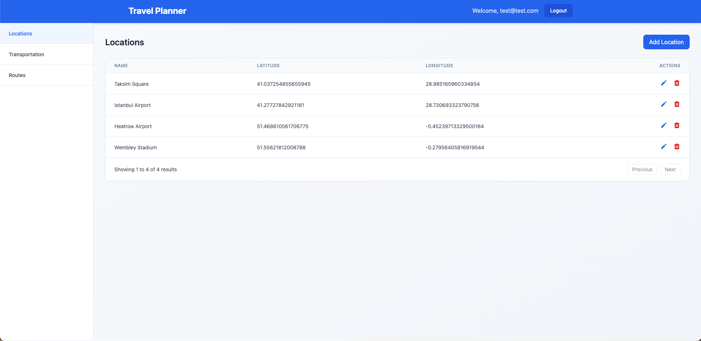
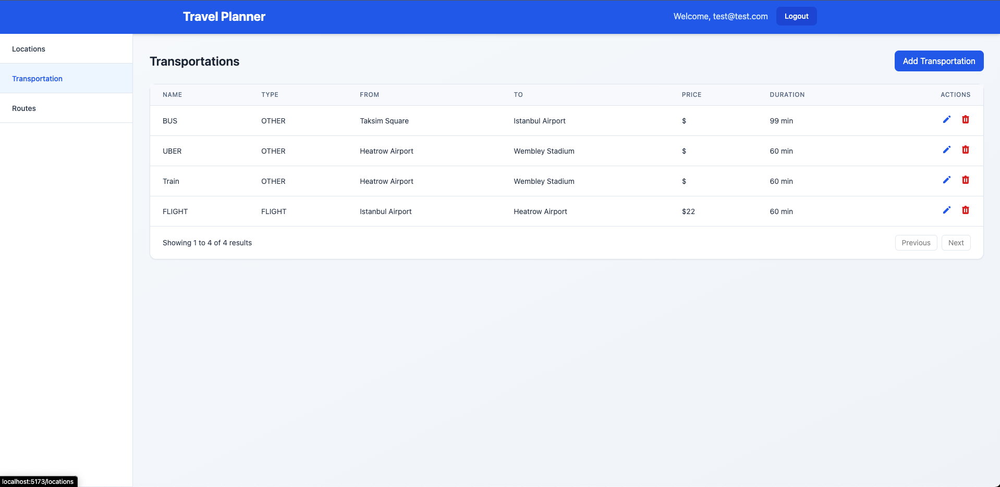
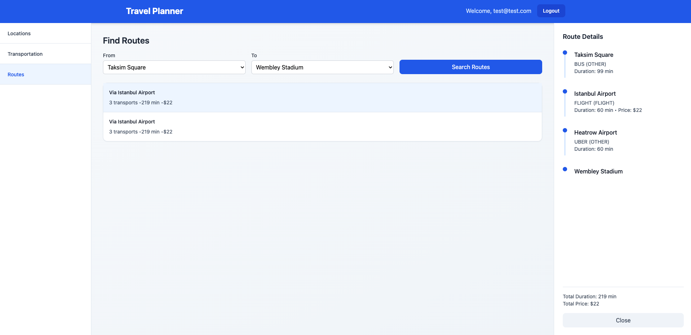

# Travel Planner Application

A full-stack application for planning travel routes between locations with multiple transportation options.

## Screenshots

### Login Page


### Locations Management


### Transportation Management


### Route Finding


## Features

- User authentication and authorization
- Location management (CRUD operations)
- Transportation management between locations
- Route finding with multiple transportation options
- Detailed route visualization with costs and durations

## Tech Stack

### Backend
- Java 21
- Spring Boot 3
- Spring Security with JWT
- PostgreSQL
- Maven

### Frontend
- React 18
- TypeScript
- Vite
- TailwindCSS
- React Router v6
- Headless UI

## Getting Started

### Prerequisites
- Docker and Docker Compose
- Node.js 18+ (for local development)
- Java 17 (for local development)

### Running with Docker

1. Clone the repository:
```bash
git clone https://github.com/yourusername/travel-planner.git
cd travel-planner
```

2. Start all services using Docker Compose:

```bash
docker-compose up --build
```

The application will be available at:
- Frontend: http://localhost:5173
- Backend API: http://localhost:8080
- PostgreSQL: localhost:5433

### Development Setup

#### Backend
1. Ensure you have Java 21 and Maven installed
2. Configure PostgreSQL database (or use Docker for Postgres only)
3. Run the Spring Boot application:
```bash
cd backend
./mvnw spring-boot:run
```

#### Frontend
1. Install dependencies:
```bash
cd frontend
npm install
```

2. Start the development server:
```bash
npm run dev
```

## Application Structure

### Backend Services

#### Authentication
- JWT-based authentication
- Login endpoint: POST `/login`
- Required fields: email, password

#### Locations
Manage travel locations (airports, stations, etc.)
- GET `/locations` - List all locations
- POST `/locations` - Create new location
- PUT `/locations/{id}` - Update location
- DELETE `/locations/{id}` - Delete location

#### Transportations
Manage transportation options between locations
- GET `/transportations` - List all transportations
- POST `/transportations` - Create new transportation
- PUT `/transportations/{id}` - Update transportation
- DELETE `/transportations/{id}` - Delete transportation

Types:
- FLIGHT
- OTHER (bus, train, etc.)

#### Routes
Find possible routes between locations
- GET `/routes?fromLocationId={id}&toLocationId={id}`
- Returns all possible routes with:
  - Total duration
  - Total price
  - List of transportations

### Frontend Pages

#### Login (/login)
- User authentication
- JWT token management
- Redirect to locations page after successful login

#### Locations (/locations)
- List all locations
- Add/Edit/Delete locations
- Location details:
  - Name
  - Latitude
  - Longitude

#### Transportations (/transportations)
- Manage transportation options
- Add/Edit/Delete transportations
- Transportation details:
  - Name
  - Type (FLIGHT/OTHER)
  - From/To locations
  - Price
  - Duration

#### Routes (/routes)
- Search routes between locations
- Display route options with:
  - Via points
  - Total duration
  - Total price
  - Transportation sequence

## Environment Variables

### Backend
```properties
SPRING_DATASOURCE_URL=jdbc:postgresql://localhost:5433/flight_routes
SPRING_DATASOURCE_USERNAME=postgres
SPRING_DATASOURCE_PASSWORD=password
```

### Frontend
```properties
VITE_API_URL=http://localhost:8080
```

## Docker Configuration

The application uses Docker Compose with three services:
1. PostgreSQL (Database)
2. Spring Boot (Backend)
3. Vite/React (Frontend)

See `docker-compose.yml` for detailed configuration.

## Testing

### Backend
```bash
cd backend
./mvnw verify
```


## License

This project is licensed under the MIT License.